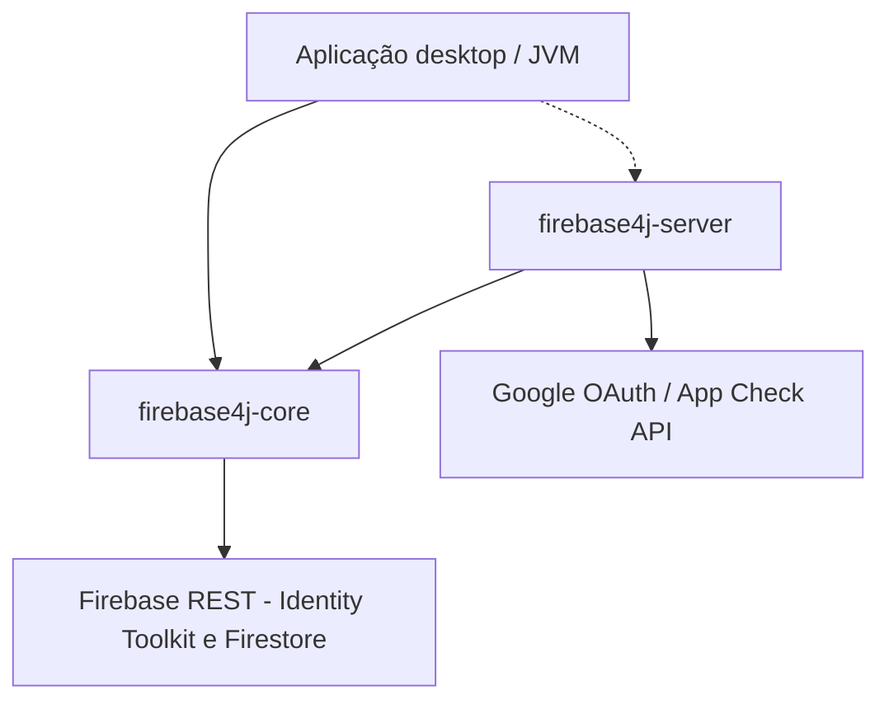

# Arquitectura (visão geral)

## Visão em camadas

- **`firebase4j-core`** implementa chamadas HTTP (via Jsoup) às APIs públicas Firebase usando **`FirebaseOptions`** (apiKey, projectId, …).
- **`firebase4j-server`** acrescenta apenas fluxos que precisam de **conta de serviço** e JWT (App Check).

## Implementações versionadas

- **Auth:** `AuthV1` — URL base Identity Toolkit com placeholder `{action}` e `{api_key}`.
- **Firestore:** `FirestoreV1` — URLs `firestore.googleapis.com/v1/...`.

Novas versões da API podem introduzir classes `AuthV2`, `FirestoreV2`, etc., mantendo entradas estáveis nas fábricas públicas quando possível.

## Persistência

O estado do **`User`** é plugável (**`FirebasePersistent`**). Por omissão não há E/S em disco; as implementações incluídas gravam JSON ou MVStore conforme [persistência](persistence.md).

## Separação cliente / servidor

Evitar **split packages** no JDK modular: o código de servidor vive em **`balbucio.org.firebase4j.server.*`**, não no mesmo pacote que o núcleo.

## Ligações

- [Índice da documentação](README.md)
